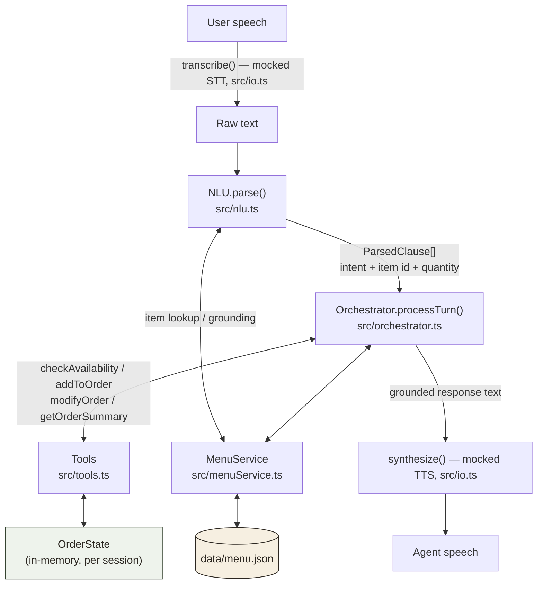
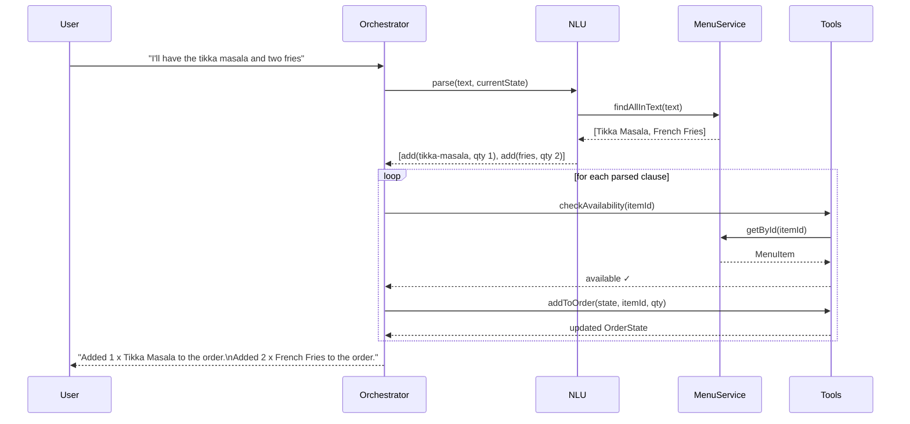
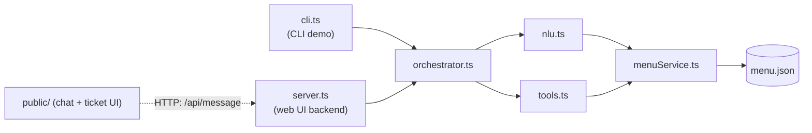

# Vima3ya Voice Agent Assessment — Restaurant Steward

A TypeScript restaurant-ordering voice agent. STT/TTS are mocked black boxes per the
assessment's scope note; the actual work here is the orchestration layer: intent
resolution, order-state management, tool calling, and menu grounding.

## How to run

```bash
npm install

# Interactive CLI - type turns yourself
npm start

# Web UI - chat interface with a live order ticket, at http://localhost:3000
npm run web

# Scripted demo - replays two full sample conversations and prints tool calls
npm run demo

# Unit tests
npm test
```

Node 18+ recommended. No API keys or external services required — the reasoning
step is rule-based (see "Why rule-based" below), so the whole thing runs offline.

## Architecture

### Pipeline



**Why this shape:** each arrow is a seam a real backend could be swapped in at
without touching the others. Swap `MenuService` for a live POS/menu API, swap
`Tools` for REST calls to an order-management system, swap `transcribe`/`synthesize`
for real STT/TTS — `NLU` and `Orchestrator` don't need to change.

### A turn, step by step

The sequence below traces one real turn from the demo — "I'll have the tikka
masala and two fries" — showing how a single utterance with two items becomes
two tool calls and one composed response.



### Module dependency graph



### Module responsibilities

| Module | Responsibility | Does NOT do |
|---|---|---|
| `menuService.ts` | Load `data/menu.json`; single point of truth for lookups, substring/alias matching, alternative suggestion | Any conversation or order logic |
| `nlu.ts` | Turn raw text into one or more `ParsedClause` — intent, resolved item id, quantity, pronoun flag | Call tools, mutate state, or generate response text |
| `tools.ts` | Pure `(state, args) → (newState, result)` functions for the four required tools | Parsing, phrasing, or menu lookups beyond what's passed in |
| `orchestrator.ts` | Own the session's `OrderState`; route clauses to tools; compose grounded response text | Text splitting/keyword matching (delegates to `nlu.ts`) |
| `io.ts` | Mocked STT/TTS boundary | Anything else — intentionally a stub per the brief |
| `server.ts` | Thin Express layer: keeps one `Orchestrator` per browser session (in-memory `Map`), exposes `POST /api/message` | Any reasoning or state logic — it only calls `orchestrator.processTurn()` |
| `public/` | Static chat UI: conversation on the left, a live "kitchen ticket" order summary on the right | Any business logic — it only renders what the API returns |

This separation is also why testing is straightforward: tool-layer checks
don't need a live conversation, and NLU behavior can be checked without touching
order state.

### Web UI

`npm run web` starts an Express server that serves a small static frontend and wraps
the same `Orchestrator` used by the CLI — no orchestration logic was duplicated for
the UI. Each browser gets a session id (stored in `localStorage`) mapped to its own
`Orchestrator` instance server-side, so multiple "tables" can order concurrently
without crossing state. The UI has two panes: a chat conversation with the steward,
and a live order summary styled as a printed kitchen ticket that updates as items are
added, corrected, or removed — the same grounding and state guarantees from the CLI
apply here, just rendered visually instead of as console output.

## Why rule-based reasoning (not an LLM call)

The brief explicitly allows either. Given a one-day window, a rule-based
resolver was the better bet for *this* assessment because:

1. **Deterministic and testable.** Every test in `tests/orchestrator.test.ts` is
   exact-match on output. An LLM call would need heavier scaffolding (retries,
   schema validation, snapshot-style assertions) to be reliably testable in the
   time available.
2. **No external dependency / API key risk.** The whole thing runs offline and
   reproducibly for whoever reviews it.
3. **The brief's own grading criteria** ("Robustness: ambiguous references,
   corrections, unavailable items handled gracefully... matters more than test
   coverage") are about orchestration behavior, not which reasoning backend
   produced it.

The seam is intentional: `NLU.parse()` is the only place that would need to
change to swap in a real LLM call (e.g. a function-calling prompt that returns
the same `ParsedClause[]` shape) — `Orchestrator`, `Tools`, and `MenuService`
would not need to change at all.

## Assumptions & tradeoffs

- **Clause splitting is heuristic, not a full parser.** Utterances are split on
  commas, and on "and"/"but" *only* when the following words contain their own
  action verb (add/cancel/remove/etc). This is what correctly separates
  "cancel the fries, add a coke instead" into two instructions while keeping
  "the tikka masala **and** two fries" as one instruction with two items. It
  will not handle arbitrarily nested compound sentences — a production system
  would likely lean on an LLM call here specifically for robustness.
- **Item matching is alias/substring based with word boundaries**, not fuzzy/
  embedding matching. It's deliberately generous with simple plurals ("cokes"
  matches "coke") but will not catch typos ("tikka masaal") or synonyms not
  listed in `aliases`. Extending the alias list is the intended way to widen
  coverage.
- **Pronoun resolution ("it", "that", "remove that") uses a single
  `lastMentionedItemId`**, updated as clauses are processed left-to-right
  (including within a single multi-clause utterance). This covers every case
  in the brief's examples but would need a richer discourse model (e.g. a
  stack of recently mentioned entities) for longer, more tangential
  conversations.
- **Alternative suggestions are same-category, tag-matched first.** If Mutton
  Rogan Josh (spicy, non-veg) is unavailable, the agent looks for another
  spicy non-veg main before falling back to any available main — this keeps
  the suggestion "reasonable" rather than arbitrary, per the requirement.
- **No persistence layer.** `OrderState` lives in memory for the process
  lifetime (one `Orchestrator` instance = one table's session), matching the
  scope of a single-session CLI demo. A real deployment would key sessions by
  call/table ID in Redis or similar.
- **Currency is hardcoded to ₹ (INR)**, matching the assessment's Indian
  restaurant framing.

## Testing

`npm test` runs 9 unit tests in `tests/orchestrator.test.ts`, chosen to cover
the specific cases the brief calls out rather than broad coverage:

- Order-state correctness: `addToOrder` quantity accumulation, `modifyOrder` removal
- Unavailable-item handling: no state mutation + a real, available alternative offered
- Ambiguous/corrected intent: "make it two", a same-utterance correction overriding
  an earlier instruction, and pronoun-based removal ("remove that")
- Grounding: spice/vegan answers traced to `menu.json`, and a compound multi-item
  add resolving each item's quantity correctly

## Sample conversations

See `logs/sample-conversation-1.md` and `logs/sample-conversation-2.md` — both
captured verbatim from `npm run demo`, not hand-written.
